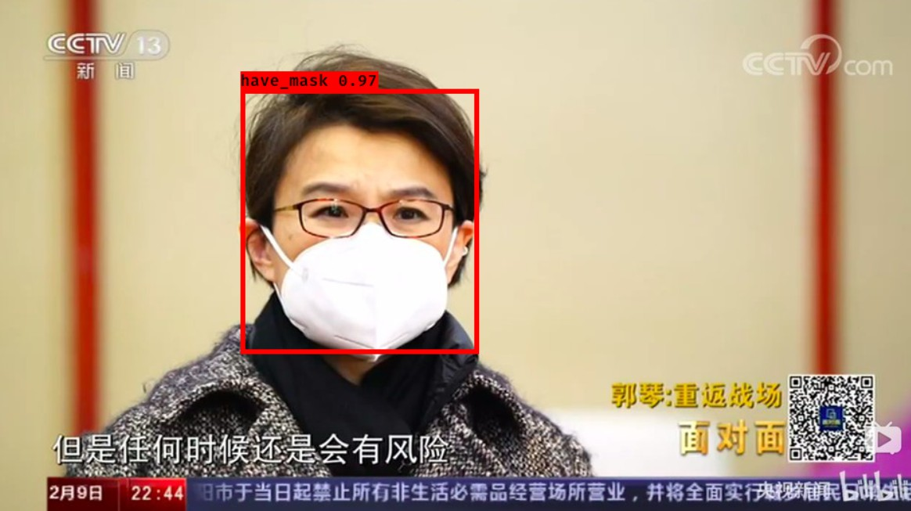

# yolo3-keras

yolo3-keras的源码，可以用于训练自己的模型yolov3以及yolov3-tiny

## 一、环境要求

- **Python：** 3.7.4
- **Tensorflow-GPU** 1.14.0
- **Keras:** 2.2.4

## 二、快速使用：

 - 1.下载yolov3-keras代码

 - 2.下载yolov3-keras权重文件[权重](https://pjreddie.com/media/files/yolov3.weights) 并将其放入根目录下

 - 3.执行如下命令将darknet下的yolov3配置文件转换成keras适用的h5文件

	`python convert.py yolov3.cfg yolov3.weights model_data/yolo.h5`

    `python convert.py yolov3-tiny.cfg yolov3-tiny.weights model_data/yolov3-tiny.h5`

	模型文件对应说明如下：
	| 模型文件                            | 说明                |
	|-------------------------------------|---------------------|
	| ep034\-loss6.105\-val\_loss6.205.h5 | 经过训练的模型      |
	| yolo\.h5                            | YOLO 官方预训练模型 |


 - 4.运行预测图像程序

	`python yolo_video.py --image`

	在命令行输入图片地址`img/mask.jpg`，即可预测

	


## 三、训练自身数据

 - 1.使用VOC格式的数据进行训练

 训练前将标签文件放在VOCdevkit文件夹下的VOC2007文件夹下的Annotation中。

 训练前将图片文件放在VOCdevkit文件夹下的VOC2007文件夹下的JPEGImages中。

 在训练前利用`voc2yolo3.py`文件生成对应的txt。

 ```sh
VOCdevkit
	-VOC2007
		├─ImageSets    # 存放数据集列表文件，由voc2yolo3.py文件生成
		├─Annotations  # 存放图片标签，xml 格式
		├─JPEGImages   # 存放数据集中图片文件
		└─voc2yolo3.py # 用来生成数据集列表文件
 ```

 - 2.生成YOLOV3所需数据

 每一行对应其图片位置及其真实框的位置

 再运行根目录`voc_annotation.py`，运行前需要将`voc_annotation`文件中classes改成你自己的classes。

 - 3.在训练前可根据自身需要修改model_data里面的`yolo_anchors.txt`和`tiny_yolo_anchors.txt`，利用`kmeans.py`来生成，k=9，生成yolo_anchors；k=6，生成tiny_yolo

 - 3.在训练前需要修改model_data里面的`voc_classes.txt`文件，需要将classes改成你自己的classes。

 - 4.修改`train.py`配置，通过修改`anchor_path`,从而选择使用yolov3训练还是yolov3-tiny训练

 - 5.运行`train.py` 即可开始训练，训练好的模型存放在logs下。


## 四、测试

 修改根目录下`yolo.py`文件，修改`model_path`,`anchors_path`,`classes_path`替换成自己的路径

 - 1.单张图片测试

 `python yolo_video.py --image`,输入图片名称即可

 - 2.电脑摄像头实时检测

 `python yolo_video.py --input`

  此外对应的yolo.py文件174行改为`vid = cv2.VideoCapture(0)`；

 - 3.测试本地视频

 `python yolo_video.py --input`

 此外对应的yolo.py文件174行改为vid = cv2.VideoCapture("视频路径+视频名+视频后缀名")；

 - 4.测试本地视频并且保存视频效果

 `python yolo_video.py --output`

 此外对应的yolo.py文件184行改为out = cv2.VideoWriter("视频路径+视频名+视频后缀名", video_FourCC, video_fps, video_size)；


## 五、注意：

  一张图片最多只能识别20个对象的问题：

 - 1.训练时，要在yolo3文件夹下面的utils.py里，修改get_random_data()函数，有一个默认参数是max_boxes=20，改成很大的数值就行了。

 - 2.检测时，要在yolo3文件夹下面的model.py里，修改yolo_eval()函数，有一个默认参数是max_boxes=20，改成很大的数值就行了。
